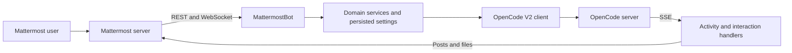

# Architecture

`src/mattermost/client.ts` implements API v4 transport. `events.ts` reconnects and filters events; `actions.ts` scopes interactive actions to a user/channel/post. `http.ts` authenticates inbound callbacks. `bot.ts` routes commands and prompts, tracks the foreground task and drains its queue. `activity.ts` converts SDK events to streamed text, tool progress and completed answers. `interactions.ts` manages permission/question cards and validates responses.

`src/app` contains transport-independent domain services, stores, formatters and scheduling. `src/opencode` normalizes the OpenCode V2 API and events into bot domain types. `src/runtime` implements paths, setup, service management and logging. The adapter export does not initialize application configuration or connect to OpenCode.

Commands are serialized separately from OpenCode events so a long-running task can receive permissions or cancellation. Long-running SDK commands release the input queue. Stream updates coalesce; event delivery is bounded and reconciles authoritative server state when necessary. Persistent delivered-message IDs suppress repeated completed answers across reconnects. Scheduled output waits until the foreground session is idle.
